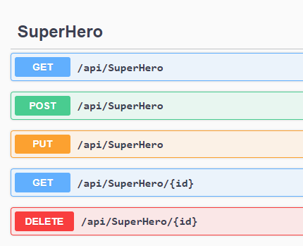

# .NET Core APIs
I aim to become a fullstack developer with Angular/React and .NET Core, below are projects that I developed to learn it. 

## #1 SuperHero CRUD - Simple demonstration
**[[ C# CODE ](https://github.com/gorj00/NET.Core_API_SuperHeroes_CRUD)]**

- **keywords:** 
  - .NET Core 6,
  - SQL Server
- **Swagger result:**

  